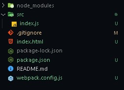
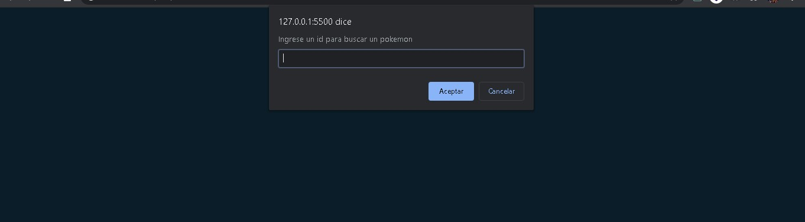

#   Webpack

Estos son mis apuntes de como yo voy aprendiendo **Webpack** con ayuda de su documentación y tutórales que encuentro en internet.

## ¿Qué es Webpack? 

Es un empaquetador de módulos o conjunto de reglas para aplicaciones modernas en JS, es una utopía en donde el producto es bueno, barato y rápido ya que nos ayuda a administrar nuestros archivos de manera eficiente para futuras modificaciones, ya que nos hace fácil de manipular dichos archivos. 

## Webpack nos ayuda a 

* Escribir aplicaciones de manera eficiente.
* Tener un código limpio.
* Aplicar tecnología para resolver sus problemas.
* Tener un conjunto de reglas y convenciones.
* Entorno de desarrollo optimizado en productividad.

## Requisitos básicos para utilizar Webpack 

Como requisitos básicos se necesita [node.js](https://nodejs.org/es/) el cual también instalara npm para administrar los paquetes. Para verificar si ya lo tienes y ver que versión tienes de node y npm debes poner en tu terminal los siguiente.

```
node -v
npm -v
```

Puedes encontrar mas información sobre comando de npm en su [documentación](https://docs.npmjs.com/).

También será necesario conocimientos en [React](https://reactjs.org/).

## 🙌 Conceptos básicos 

Para entender mejor el proceso de configuración hay que entender bien sus conceptos.

* **Entry:** Indica qué módulo webpack debería usar para comenzar a construir su gráfica de dependencias. De forma predeterminada su valor es `./src/index.js`, pero pude especificarse un punto de entrada diferente o múltiples puntos de entrada

* **Output:** La salida en webpack hace referencia a la ubicación dónde emitir los paquetes que crea como dependencias y cómo nombrar estos archivos. Su valor predeterminado  es `./dist/main.js`.

* **Loaders:** Ayuda que webpack procese otros tipos de archivo como `.css` y los convierta en módulos válidos que su aplicación pueda consumir y agregar al gráfico de dependencias. 

  Los **loaders** tienen dos propiedades en la configuración de sus paquetes: 

  1. `test` propiedad que indica qué tipo de archivo o archivos debe transformarse.
  2. `use` propiedad que indica qué loader debe usar para realizar la transformación

* **Plugins:** Realiza tareas como la optimización de paquetes, la gestión de archivos y la inyección de variables de entorno. Para utilizar un plugin es necesario `require()` y agrega e a la `plugins` matriz.  

* **Mode:** Un parámetro para indicar en que modo se esta ejecutando webpack `development`, `production` o `none`, para cada entorno incorpora optimizaciones diferentes. El valor por defecto es `production` .

## Primero empezaremos un proyecto

### Qué necesitamos instalar

Como dependencias de desarrollo serán:

1. **Webpack**: es el core del sistema, para manipular los archivos
2. **Webpack-cli** es la herramienta o api utilizada para ejecutar webpack, funciona como parte para la configuración de webpack. *Cli significa coman line interface*.

Bueno con esto ya puedes empezar instalándolas.

```
npm install -D webpack webpack-cli
```

El **-D** es igual al **--save-dev** para instalar como dependencia de desarrollo.

Está seria la estructura usaremos por ahora una carpeta **src** que tendrá todos   nuestros archivos del proyecto. El **.gitignore** para decirle a git que archivos no se  requiere que tenga seguimiento. El **index.hml** para la plantilla html que tomara  webpack. Y el **webpack.config.js** que gracias al cli de webpack configuraremos según nuestras necesidades. En el archivo **index.js** puedes agregar un `console.log('Hello Word')` para comenzar.



### Configuración para empezar el webpack.config.js

Este archivo esta escrito en **CommonJS** que se utiliza para definir una serie de especificaciones fuera del navegador.


```javascript
const path = require('path');
module.exports = {
	entry: './src/index.js',
	output: {
		filename: 'bundle.js',
		path: path.resolve(__dirname, 'dist'),
	},
    mode: 'developmen'
};
```

El modulo que se utilizara es [Path](https://nodejs.org/api/path.html) que es un modulo nativo de node y se utiliza para trabajar con rutas de archivos y directorios. Como se puede notar se esta exportando un objeto con el `module.export` algo parecido con al `export default`. En el apartado de conceptos básicos se definió el entry y el output que son como salida y entrada.

- En el **entry** le decimos donde esta nuestro archivo javascript principal.
- En el **output** se dira donde queremos poner el proyecto ya pasado por webpack. Las configuraciones principales serán el **filename** que es el nombre del archivo de salida, y el **path** que es la ubicación del archivo para eso se utiliza el modulo path con el método [**resolve**](https://nodejs.org/api/path.html#path_path_resolve_paths) y por parámetros le diremos un conjunto de rutas que va mezclar. Utilizaremos **__dirname** que es una variable para manejar rutas. 
- Puedes agregar una tercera configuración llamada **mode** con **developmen** o **production**

### Probar la configurado por ahora 

Puedes hacerlo de manera tediosa con `npx webpack` o agregando un script en el package.json.

```javascript
"scripts": {
	"build": "webpack"
},
```

y en tú terminal escribes `npm run build`. Si todo va bien veras un nuevo archivo llamado dist y dentro un archivo llamado **bundle.js**. Después puedes agregar el script en el index.html para probar.

## Plugins HtmlWebpackPlugin

El [HtmlWebpackPlugin](https://webpack.js.org/plugins/html-webpack-plugin/) se utiliza para crear y simplificar un archivo html. Para instalarlo es el comando:

```
npm install -D html-webpack-plugin
```

Para está ocasion creamos una carpeta `public` y en ella movemos el archivo `index.html` y un archivo `.ico`(no es necesario que sea ese formato). En el archivo `index.js` agregas lo siguiente:

```javascript
document.body.innerHTML = '<h1>Hello World</h1>';
```

Para agregar a la fuerza código html en el navegador. Ahora en las configuraciones de webpack agregamos.

```js
const HtmlWebpackPlugin = require('html-webpack-plugin');
module.exports = {
    // ...
	// Las configuraciones anteriores
	plugins: [
		new HtmlWebpackPlugin({
            template: './public/index.html',
			filename: './index.html',
			favicon: './public/favicon.ico',
		}),
	],
};
```

Se llama el HtmlWebpackPlugin y en la propiedad **plugins**, el cual es un arreglo, se agrega HtmlWebpackPlugin instanciándolo por que es una clase y se agregan ciertas configuraciones.

- **filename**: El nombre del html generado.
- **favicon**: El icono que se muestra en la pestaña.
- **template**: La ubicación del `hmtl` que queremos usar. Esto es parecido a react, el cual pronto daremos un ejemplo.

Al ejecutar el comando `npm run build` en la carpeta `dist` notaras un index.html y el nuevo favion.ico. Existe otras parámetros que se pueden dar para el html, esta en la [documentación](https://github.com/jantimon/html-webpack-plugin). Para probar esto de forma local puedes usar [Live Server](https://marketplace.visualstudio.com/items?itemName=ritwickdey.LiveServer), cuando agregues react te será de ayuda, o también puedes usar [serve](https://www.npmjs.com/package/serve) que hará más o menos lo mismo.

## Utilizando CSS

Para que webpack procese el css hay que installar dos loaders.

- **[css-loader](https://webpack.js.org/loaders/css-loader/)**: que interpretara los `@import` y los `url()` y los pasara a `import/require()`.
- **[style-loader](https://webpack.js.org/loaders/style-loader)**: Inyectara los estilos es el DOM.

```
npm install -D style-loader css-loader
```

Ahora en el webpack.config.js al ser loaders que se utilizan para diferentes tipos de archivos, tiene que ser convertidos en [modulos](https://webpack.js.org/concepts/modules/) validos para que la aplicación pueda consumir y agregar a las dependencias. En el archivo agregar lo siguiente:

```javascript
module: {
	rules: [
        {
            test: /\.css$/i,
            use: [ 'style-loader', 'css-loader' ],
        },
    ],
},
```

El  parámetro `test` con expresiones regulares indica el formato de archivos que tiene que buscar.

Ahora puedes crear una carpeta `css` y creas un `main.css` con lo siguiente:

````css
* {margin: 0;}
body {
	background-color: hsl(202, 55%, 10%);
	width: 100vw;
	height: 100vh;
	display: flex;
	justify-content: center;
	align-items: center;
	text-align: center;
}
h1 {
	color: hsl(0, 0%, 92%);
	font-size: 2em;
	font-family: monospace;
	margin-bottom: 1rem;
}
````

Y en el `index.js` lo importas.

```js
import './css/main.css';
```

Ejecutas el `npm run build` y pruebas el index.html.

## Cargando imágenes

Para cargar imágenes con webpack utilizando el **[file-loader](https://webpack.js.org/loaders/file-loader)**, existen otros métodos pero por el momento solo utilizare este. Lo primero es instalarlo:

```
npm install -D file-loader
```

No olvides el  -D. En el archivo de webpack.config.js agregamos lo siguiente.

```js
{
	test: /\.(png|jpe?g)$/i,
    loader: 'file-loader',
    options: {
    	outputPath: 'assets/img',
        name: '[name].[ext]',
	},
},
```

Aquí como puedes ver no utilizamos el use como con los loader css por que solo es un loader pero si fueran varios si seria necesario usar el use, y el `options` que es el que lleva la configuración del **file-loader** iría con él dentro del arreglo. Para probar puedes agregar lo siguiente en el `index.js`.

```js
import image from './img/imagen.png';
const body = document.body;
body.innerHTML = `
<div>
    <h1>Hello World</h1>
    
</div>`;
```

Dentro de `src` creas una carpeta llamada `img` y dentro agregas la imagen. Ejecutas `npm run build` y listo.

## Recopilar 


Hasta ahora ya tenemos una templeta de `html`, ya cargamos `css` y cargamos imágenes, tendríamos algo así:


## Agregando Babel

Si quieres usar javascript moderno en tu proyecto deberás agregar una tecnología llamada [Babel](https://babeljs.io/), y lo que hará es tomar nuestro javascript y convertirlo a una versión no tan moderna de javascript que soporte el navegador. Lo primero será instalar lo que por ahora necesitamos:

```
npm i -D  babel-loader @babel/core @babel/preset-env @babel/plugin-transform-runtime
```

```
npm install @babel/runtime
```

- `babel-loader`:  es el loader que se utiliza para que babel y webpack trabajen juntos.
- `@babel/core`: es el corazón de babel.
- `@babel/preset-env`:  ayuda a transformar código actual en código soportado por el navegador.
- `@babel/plugin-transform-runtime`: nos ayudara principalmente a escribir código asíncrono.
- `@babel/runtime`: es el corazón por el cual utilizaremos para escribir código asíncrono.

Ahora hay que ir al `webpack.config.js` y agregar en las `rules` lo siguiente:

```js
{
    test: /\.js$/i,
    use: 'babel-loader',
    exclude: /node_modules/,
},
```

El `test` como siempre se encarga de buscar los archivos, en este caso los terminados en  `.js`. El loader que se usara y el parámetro `exclude: /node_modules/` que le indicamos a babel omitir la carpeta node_modules.

Ahora hay que crear un archivo llamado `.babelrc` y en el escribimos lo siguiente:

```json
{
    "presets": [ "@babel/preset-env" ],
    "plugins": [ "@babel/plugin-transform-runtime" ]
}
```

El `presets` es para los pre-ajustes y los `plugins` que son complementos para mejorar el soporte de javascript.

Para probarlo utilizaremos la API de [Pokemon](https://pokeapi.co). Lo primero será crear un nuevo archivo llamado `search.js` y dentro creamos una función que recibirá un parámetro llamado `id`, la función utilizará `asinc` y en ella haremos la consulta a la api.

```js
async function searchPokemon(id){
	const res = await fetch(`https://pokeapi.co/api/v2/pokemon/${id}`);
	const poke = await res.json();
	return poke;
}
export default searchPokemon;
```

Ahora en `index.js` llamamos la función y recibiremos el parámetro por medio de un `prompt`. En el `then` llamamos una función que utilizaremos para renderizar los datos recibidos de la api.

```js
import searchPokemon from './search';
// Mensaje al inicio por el cual recibiremos el id para la api
const id = prompt('Ingrese un id para buscar un pokemon');
// Ejecutamos la api 
searchPokemon(id).then(data => {
		render(data);
	}).catch(error => console.log(error));
// Para renderizar la informacion
const render = data => {
	const pokemonImg = document.createElement('img');
	pokemonImg.setAttribute('src', data.sprites.front_default);
	pokemonImg.classList.add('pokeImg');
	document.body.append(pokemonImg);
};
```

Y si todo sale bien se vera así.




## Agregando  React

Como principal deberás de instalar `react react-dom` como dependencias de producción:

```
npm install react react-dom
```

Y para que babel como webpack puedan compilar ese código deberás de instalar `@babel/preset-react`

```
npm install -D @babel/preset-react
```

 Una vez ya instalado solo tendrás que modificar `.babelrc` de esta forma:

```js
"presets": [
    "@babel/preset-env",
    "@babel/preset-react"
],
```

Ahora para empezar con react hay que ir al html que se usa como **template** y en el `body` agregar lo siguiente:

```html
<body>
    <div id="root"></div>
</body>
```

En el `index.js` se importará `react` y `react-dom` para empezar, luego se usara la función `render` de `react-dom` para renderizar un componente llamad `App` que crearemos luego y como segundo parámetro le pasamos donde debe de insertar el componente.

```js
import './css/main.css';
import React from 'react';
import ReactDOM from 'react-dom';
import App from './App';
ReactDOM.render(<App />, document.getElementById('root'));
```

 Ahora hay que crear el archivo `App.js`, en el importamos `react` y una imagen para seguir con lo que se vio anteriormente. Creamos una función y la exportamos por default dentro agregamos la imagen. Algo como esto:

```jsx
import React from 'react';
import image from './img/imagen2.png';
export default function App(){
	return (
		<div>
			<h1>Hello World</h1>
			
		</div>
	);
}
```

Y listo, ejecutas el `npm run build` y verías en el navegador algo como esto:


## Webpack server

[Webpack dev server](https://webpack.js.org/configuration/dev-server/) nos ayudara a ser mas eficientes a la hora de estar desarrollando la aplicación. Si no quieres utilizarlo pero sientes tedioso esta haciendo el `npm run build` en cada momento, lo que puedes hacer es agregarle ` -- -w` al final del comando, quedara algo como esto:

```
npm run build -- -w
```

Y al ejecutarlo mostrara un mensaje que dirá algo así`[webpack-cli] watching files for updates...`. Puedes cambiar algo de un archivo y ver que se vuelve a ejecutar el comando.

Si no te gusta estar haciendo lo anterior, por que se recarga la pagina, puedes utilizar `webpack-dev-server`, para usarlo deberás también instalar [@webpack-cli/serve](https://github.com/webpack/webpack-cli/blob/master/packages/serve/README.md#webpack-cli-serve) para que funcione de manera correcta. También deberás instalar [Clean plugin for webpack](https://github.com/johnagan/clean-webpack-plugin#options-and-defaults-optional) que limpiara de forma predeterminada `output.path` cada vez que se ejecute el server.

```
npm install -D webpack-dev-server @webpack-cli/serve clean-webpack-plugin
```

Una vez instalado agregas un nuevo script en el `package.json`, yo lo voy a llamar `"dev": "webpack-cli serve"`. En el `webpack.config.js` agregas unas configuraciones opcionales:

```js
// Arriba de HtmlWebpackPlugin
const { CleanWebpackPlugin } = require('clean-webpack-plugin');
// Dentro de module.exports
plugins: [
    new CleanWebpackPlugin(),
    new HtmlWebpackPlugin({
        template: './public/index.html',
        filename: './index.html',
        favicon: './public/favicon.ico',
    }),
],
devServer: {
    contentBase: './dist',
	port: 9000,
    open: true,
},
```

Al ejecutar el comando deberá de abrirse el navegador en el puerto 9000 y listo ya tiene un server. Con esto puede hacer cambios en el proyecto y automáticamente verás reflejados los cambios.

## Conclusión

Con esto ya puedes trabajar tranquilo en un proyecto con react que soporte javascript moderno, imágenes, css de forma tranquila.
